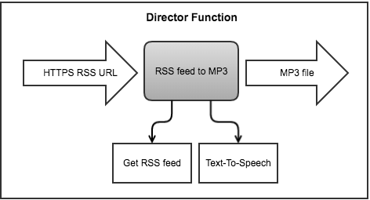

# Appendix

## Find metrics with Prometheus (PromQL)

Now we saw that there are already two ways to get a function's invocation count:

* You can click on the function in the Portal UI
* You can also type in `faas-cli list`

The third option is to use the Prometheus UI which is baked-in as part of the OpenFaaS project.

http://localhost:9090 - if you are using a remote server replace localhost for your public IP address

Into "Expression" type:

```
rate ( gateway_function_invocation_total [20s] ) 
```

Now hit *Execute* followed by *Graph*. This will give you a rolling rate of how many times each function is being invoked.

Prometheus is constantly recording this information - you can even see a break-down by HTTP response code which is useful for detecting failure or errors within one of your functions.

Type in:

```
$ echo test | faas-cli invoke non-existing-function
```

Now give it a few seconds and check what you see on the UI. There should be a 500 error for the function name `non-existing-function.

To only see statistics from HTTP 200 type in:

```
rate ( gateway_function_invocation_total{code="200"} [20s] ) 
```

To only see a specific function such as `figlet` type in:

```
rate ( gateway_function_invocation_total{function_name="figlet"} [20s] ) 
```

## The Director pattern (for function chaining)

The *Director pattern* as [documented here](https://github.com/openfaas/faas/blob/master/guide/chaining_functions.md#function-director-pattern) is where one function *the director* exists only to call another function and return the result. It is a mixture of the two techniques we explored above.




In the diagram above the *director function* named "RSS Feed to MP3" creates a workflow by calling two functions on the server-side and then returning the result. The advantage of using a director function is that this function can be versioned, built and deployed in exactly the same way as the functions it makes use of.

The URL passes through the director to the "Get RSS feed" function, the result (a parsed RSS feed) would be fed into the "Text-To-Speech" function resulting in an MP3 file as an output.
