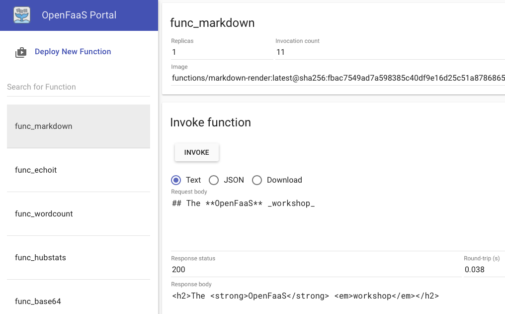

# Lab 2 - Testing things out

</img>

## Use the UI Portal

You can now test out the OpenFaaS UI by going to http://localhost:8080 or http://127.0.0.1:8080 - if you're deploying to a Linux VM then replace localhost with the IP address from the output you see on the `ifconfig` command.

Note: on some Linux distributions accessing `localhost` may hang, if that happens then please use `127.0.0.1` instead and replace it wherever you see `localhost`.

In the default stack we deploy several sample functions.



You can try them out in the UI such as the Markdown function which converts Markdown code into HTML.

Type the below into the *Request* field:

```
## The **OpenFaaS** _workshop_
```

Now click *Invoke* and see the response appear in the bottom half of the screen.

I.e.

```
<h2>The <strong>OpenFaaS</strong> <em>workshop</em></h2>
```

You will see the following fields displayed:

* Replicas - the amount of replicas of your function running in the swarm cluster
* Image - the Docker image name and version as published to the Docker Hub or Docker repository
* Invocation count - this shows how many times the function has been invoked and is updated every 5 seconds

Click *Invoke* a number of times and see the *Invocation count* increase.

## Deploy via the Function Store

You can deploy a function from the OpenFaaS store. The store is a free collection of functions curated by the community.

* Click *Deploy New Function*
* Click *From Store*
* Click *Figlet* or enter *figlet* into the search bar and then click *Deploy*

The Figlet function will now appear in your left-hand list of functions. Give this a few moments to be downloaded from the Docker Hub and then type in some text and click Invoke like we did for the Markdown function.

You'll see an ASCII logo generated like this:

```
 _  ___   ___ _  __
/ |/ _ \ / _ (_)/ /
| | | | | | | |/ / 
| | |_| | |_| / /_ 
|_|\___/ \___/_/(_)
``` 

## Learn about the CLI

You can now test out the CLI, but first a note on alternate gateways URLs:

If your gateway is not deployed at http://localhost:8080 then you will need to specify the `--gateway` flag followed by the alternate URL such as http://127.0.0.1:8080/. 

> A shorter versions of flags are available most of the time so `--gateway` can be shortened to `-g` too. Check `faas-cli --help` for more information.

### List the deployed functions

This will show the functions, how many replicas you have and the invocation count.

```
$ faas-cli list
```

You should see the *markdown* function as `func_markdown` and the *figlet* function listed too along with how many times you've invoked them.

Now try the verbose flag

```
$ faas-cli list --verbose
```
or

```
$ faas-cli list -v
```

You can now see the Docker image along with the names of the functions.

### Invoke a function

Pick one of the functions you saw appear on `faas-cli list` such as `func_markdown`:

```
$ faas-cli invoke func_markdown
```

You'll now be asked to type in some text. Hit Control + D when you're done.

Alternatively you can use a command such as `echo` or `uname -a` as input to the `invoke` command which works through the use of pipes.

```
$ echo Hi | faas-cli invoke func_markdown

$ uname -a | faas-cli invoke func_markdown
```

You can even generate a HTML file from this lab's markdown file with the following:

```
$ cat lab2.md | faas-cli invoke func_markdown
```

## Find metrics with Prometheus

Now we saw that there are already two ways to get a function's invocation count:

* You can click on the function in the Portal UI
* You can also type in `faas-cli list`

The third option is to use the Prometheus UI which is baked-in as part of the OpenFaaS project.

http://localhost:9090 - if you are using a remote server replace localhost for your public IP address

Into "Expression" type:

```
rate ( gateway_function_invocation_total [20s] ) 
```

Now hit *Execute* followed by *Graph*. This will give you a rolling rate of how many times each function is being invoked.

Prometheus is constantly recording this information - you can even see a break-down by HTTP response code which is useful for detecting failure or errors within one of your functions.

Type in:

```
$ echo test | faas-cli invoke non-existing-function
```

Now give it a few seconds and check what you see on the UI. There should be a 500 error for the function name `non-existing-function.

To only see statistics from HTTP 200 type in:

```
rate ( gateway_function_invocation_total{code="200"} [20s] ) 
```

To only see a specific function such as `figlet` type in:

```
rate ( gateway_function_invocation_total{function_name="figlet"} [20s] ) 
```

* Further reading:

The metrics within Prometheus can be turned into a useful dashboard with free and Open Source tools like [Grafana](https://grafana.com).

A pre-made [dashboard.json](https://raw.githubusercontent.com/openfaas/faas/master/contrib/grafana.json) file can be imported to Grafana for use with OpenFaaS. We suggest you look at this after completing the workshop.

<a href="https://camo.githubusercontent.com/24915ac87ecf8a31285f273846e7a5ffe82eeceb/68747470733a2f2f7062732e7477696d672e636f6d2f6d656469612f4339636145364358554141585f36342e6a70673a6c61726765"></a>

Now move onto [Lab 3](./lab3.md)
